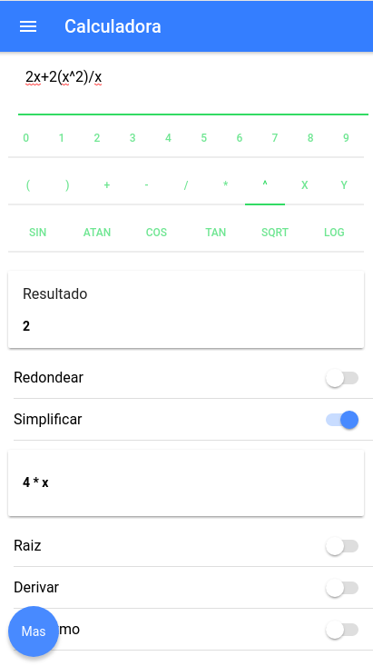

# **HybridMath**

## Features
- [x] Evaluate and resolve expressions
- [x] Dynamic rounding of real numbers
- [x] Basic trigonometry
- [x] Simplify expressions
- [x] Differential equations
- [ ] Graph simulation
- [ ] Markov chain analysis
- [ ] Unit converter _(in progress)
- [ ] Vectors analysis

## Screenshots


## How to use this template

*This template does not work on its own*. The shared files for each starter are found in the [ionic2-app-base repo](https://github.com/ionic-team/ionic2-app-base).

To use this template, either create a new ionic project using the ionic node.js utility, or copy the files from this repository into the [Starter App Base](https://github.com/ionic-team/ionic2-app-base).

### With the Ionic CLI:

```bash
$ sudo npm install -g ionic cordova
$ git clone https://github.com/juliandavidmr/HybridMath
```

Then, to run it, cd into `HybridMath` and run:

```bash
$ ionic serve
```


**License MIT**